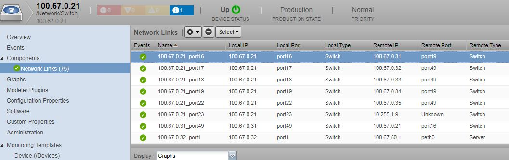
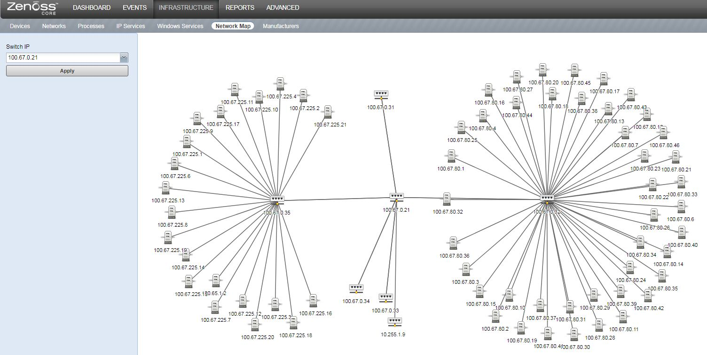

# ZenPacks.itri.NetworkTopology

Maps network topology in Zenoss using LLDP and D3.

## Usage

Switch devices are added to the `/Network/Switch` device class. Once they are added they will be modeled by Zenoss and the available network links will be discovered and modeled:

The network topology map can then be visualized by navigating to *Infrastructure > Network Map* and selecting a switch device from the menu and clicking *Apply*:

This ZenPack replaces Zenoss's original default *Network Map* page.